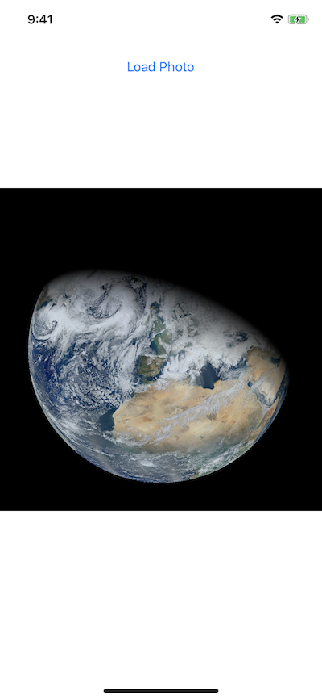
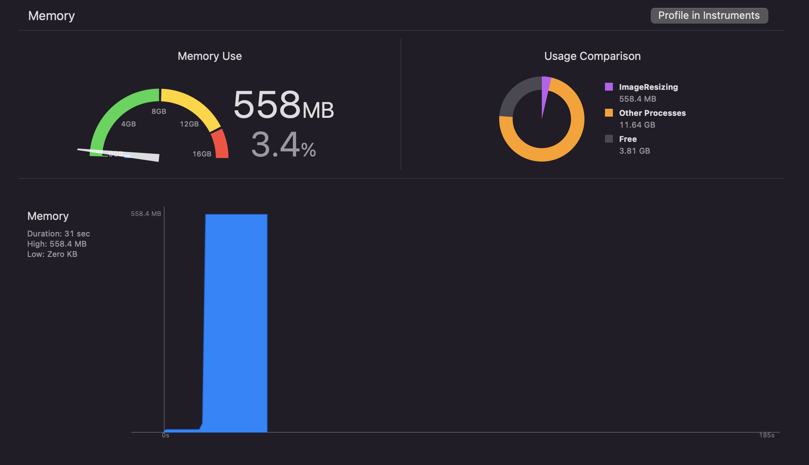
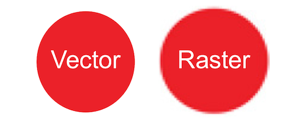

这篇文章将介绍如何计算图片渲染后占用内存大小，其占用内存的根本原因，以及如何减小图片内存占用。

## 1. 图像内存占用

当渲染高清图片时，app 内存占用会升高。为了演示该问题，创建了一个`ImageResizing`的demo。点击*Load Photo*按钮，显示图片。

```
    @IBAction func loadPhotoButtonTapped(_ sender: Any) {
        imageView.image = UIImage(named: "visibleEarth")
    }
```



上图中显示的图片宽高为12000px*12000px，文件大小20.9MB。

内存占用如下：



加载图片后，内存占用从8MB飙升到558.4MB。

为什么加载一张20.9MB的图片，会消耗五百多MB的内存？

## 2. 内存占用 ≠ 文件大小

上面使用了 Apple 推荐的`UIImage`、`UIImageView`方式加载图片，在遇到特定图片时，内存占用可能出现异常。

每次的WWDC都在讨论性能最佳实践，如：iOS app 应尽可能少的占用内存。内存是 iOS 上最有限的资源，系统请求内存的速度可能快于内存释放的速度。iOS 系统不支持传统的 SWAP 交换机制，其使用了内存压缩（memory compressor）技术。

通常，用户会安装多个 app。处于后台的 app 仍可能占用内存，系统本身也会占用一些内存。系统设置了 app 可使用内存上限，app 内存占用超过阀值会被杀死。

## 3. 图像渲染流程

iOS 中最常见的渲染图片的方式就是使用`UIImageView`和`UIImage`。`UIImage`管理图片数据、转换、缩放，`UIImageView`在界面中渲染图像。

WWDC 「Image and Graphics Best Practices」session中，Apple 工程师介绍了使用`UIImage`在`UIImageView`中渲染图像的流程：

1. 加载编码的图像数据到内存中。
2. 解码数据到指定格式，以便渲染系统可以识别。
3. 渲染解码后的数据。


#### 3.1 图像类型

图像主要有两种类型：光栅图（raster）和矢量图（vector），光栅图也称为位图（bitmap）。

光栅图由多个矩形像素构成，每个像素存储编码后的数据信息。矢量图根据 2D 点定义，由线、多边形和其他形状连接。与光栅不同，矢量格式存储绘制图像的指令。

光栅图和矢量图有不同的优缺点，适用场景也不同。矢量图常用于物理产品、logo、技术图纸，文字、icon，以及包含尖锐几何形状的图案，主要优势在于独立于分辨率，即放大后不会失去清晰度和质量。矢量图像使用数学公式计算从一个点到另一个点构成的线。因此，与分辨率无关，放大不会失真。



光栅图由特定数量的像素组成。放大图像时会变得模糊，出现锯齿状。光栅图更适合于照片类似的复杂场景。因为，光栅图使用大量不同颜色的像素，可以通过修改单个像素颜色，达到不同的色调和层次。


#### 3.2 图像压缩

图像压缩涉及很多内容，这里只关注与本文相关的部分。图像压缩是为了去掉冗余数据，方便存储和传输。

图像编码使用了两种类型的图像压缩：

- 无损压缩（lossless compression），压缩后图像质量不变，文件可以解压缩到其原始质量，压缩是可逆的。
- 有损压缩（lossy compression），压缩会永久移除数据，过程不可逆，即不能解压缩为原始质量的图像，压缩是不可逆。

iOS 常用图片格式PNG、JPEG都是光栅图，SVG格式是矢量图。PNG是无损压缩，JPEG 是有损压缩。尽管存储方式不同，矢量图文件也可能很大。

根据文档，iOS 原生支持以下格式图像：

>  .png、.tiff、.tif、.jpeg、.jpg、.gif、.bmp、.BMPf、.ico、.cur、.xbm。

上述所有格式的图片都是光栅图。因此，这里的压缩仅涉及光栅图压缩。

#### 3.3 加载图像数据到内存

缓冲区（buffer）用来临时存储数据，以供使用。例如，音频数据添加到 buffer 后，播放器就可以开始播放了，同时数据会被继续拼接到 buffer。当`UIImage`加载图片时，图片数据会被加载到 data buffer，但其此时不能描述图像像素信息。

帧缓冲区（frame buffer）是渲染命令和图形管道的最终目的地，其包含数据渲染信息。Renderer 与 frame buffer 协同工作。但 data buffer 中编码的图片数据如何转换为包含像素信息 frame buffer？这里就涉及到解码。

#### 3.4 解码 Decoding

解码阶段，压缩的图像数据被解压为 GPU 可以识别的格式，解压的数据存储到图片缓冲区（image buffer），image buffer中的数据包含图片像素信息。之前已经讨论过，栅格图由一组像素构成，每个像素都有一种颜色。因此，image buffer占用内存大小和图片尺寸有关。

像素颜色由一个或多个颜色通道，外加alpha通道构成。例如，RGB颜色模型有red、green、blue三个颜色通道；RGBA颜色模型额外增加了一个alpha通道。[About Color Spaces](https://developer.apple.com/library/archive/documentation/Cocoa/Conceptual/DrawColor/Concepts/AboutColorSpaces.html)文档介绍了更多相关信息。

像素格式包含以下信息：

- 每个颜色成分（component）位数，即像素中单个颜色分量（color component）包含位数。
- 每个像素位数，该值为单个颜色成分位数乘以像素成分数。
- 每行字节数。图片每行字节数。

Quartz 2D 中 RGBA 颜色空间32位像素格式如下：


iOS 默认颜色空间是标准RGB（Standard RGB，sRGB），每个像素占4位，想要计算 image buffer 大小，需使用特定颜色空间中单个像素大小乘以总像素数量。例如，图片分辨率是12000*12000，文件大小为20.9Mb，占用内存为：

12000 * 12000 *4 = 576000000 bytes = 549.32MB

## 4. 图像下采样方案

我们已经了解了内存使用的来源，那如何将内存占用降低到可接受的水平呢？`UIImage`调整大小的代价很高。在调整大小的过程中，iOS 仍然会解码和解压缩原始图像，从而导致不必要的内存占用。

有多种调整图片大小的方案，各自有不同的能力和性能差异。这篇文章介绍的方案涉及底层和高级 framework，例如：Core Graphics、vImage、Image I/O、Core Image和UIKit。

为了保持一致性，不同方案使用同一接口，如下所示：

```
static func resizedImage(at url: URL, for size: CGSize) -> UIImage? {
  ...
}

imageView.image = resizedImage(at: url, for: size)
```

这里的`size`是point大小，而非pixel大小。要计算图片pixel大小，需乘以`UIScreen`的`scale`：

```
        let scaleFactor = UIScreen.main.scale
        let scale = CGAffineTransform(scaleX: scaleFactor, y: scaleFactor)
        let size = imageView.bounds.size.applying(scale)
```

#### 4.1 UIGraphicsImageRender

`UIKit`framework在iOS 10 中增加的`UIGraphicsImageRendere`是调整图片大小相关API中最高级的。你可以向`UIGraphicsImageRenderer`上下文中绘制缩小的图片：

```
    static func resizedImage(at url: URL, for size: CGSize) -> UIImage? {
        guard let image = UIImage(contentsOfFile: url.path) else { return nil }
        
        var format: UIGraphicsImageRendererFormat
        if #available(iOS 11.0, *) {
            format = .preferred()
        } else {
            format = .default()
        }
        format.opaque = false
        format.scale = UIScreen.main.scale

        let renderer = UIGraphicsImageRenderer(size: size, format: format)                 
        return renderer.image { context in
            image.draw(in: CGRect(origin: .zero, size: size))
        }
    }
```

`UIGraphicsImageRenderer`API是用来取代`UIGraphicsBeginImageContextWithOptions`和`UIGraphicsEndImageContext`API的。

`UIGraphicsImageRendererFormat`对象的属性决定底层的Core Graphics context的属性。其有以下两种选项：

- `default()`：该format永远代表设备的最高保真度，而不关心设备当前采用的保真度。如果使用没有format参数的render，其在初始化时默认使用`default()`format。
- `preferred()`：为当前主屏幕配置优化性能后的format。如果内容会被立即渲染到屏幕中，推荐使用`preferred()`。

renderer的`image`方法参数为闭包，闭包执行完毕后返回一个光栅图，即原图下采样后绘制的图片。

> 经常会遇到保持纵横比的情况下缩放原始大小的需求，`AVFoundation`中的`AVMakeRect(aspectRatio:insideRect:)`方法可以很优雅的处理这一问题，无需自行计算：
>
> ```
> import func AVFoundation.AVMakeRect
>         let rect = AVMakeRect(aspectRatio: image.size, insideRect: imageView.bounds)
> ```

#### 4.2 Core Graphics Context

Core Graphics 提供了更底层的API，配置更为灵活。

给定一个`CGImage`，使用`draw(_:)`方法在临时位图上下文中渲染缩放的图像：

```
    static func resizedImage(at url: URL, for size: CGSize) -> UIImage? {
        precondition(size != .zero)
        
        guard
            let imageSource = CGImageSourceCreateWithURL(url as NSURL, nil),
            let image = CGImageSourceCreateImageAtIndex(imageSource, 0, nil)
        else { return nil }
        
        let context = CGContext(data: nil,
                                width: Int(size.width), height: Int(size.height),
                                bitsPerComponent: image.bitsPerComponent,
                                bytesPerRow: image.bytesPerRow,
                                space: image.colorSpace ?? CGColorSpace(name: CGColorSpace.sRGB)!,
                                bitmapInfo: image.bitmapInfo.rawValue)
        context?.interpolationQuality = .high
        context?.draw(image, in: CGRect(origin: .zero, size: size))
        
        guard let scaledImage = context?.makeImage() else { return nil }
        
        return UIImage(cgImage: scaledImage)
    }
```

`CGImageSourceCreateWithURL(_:_:)`创建了 image source，从指定 url 读取数据，避免将整张图片载进内存。

> 创建的`CGImageSource`需使用`CFRelease`释放。但由于新增的CF_IMPLICIT_BRIDGING_ENABLED宏，开启了arc_cf_code_audited，Swift可以自动管理CoreFoundation对象引用计数。

`CGImage`与`CGImageSource`类似，也需要调用`CGImageRelease`释放。

`CGContext`的初始化方法需要多个参数来构造一个上下文，包含所需尺寸，指定颜色空间内每个通道占用内存。在这个示例中，这些参数从`CGImage`对象中获取，设置`interpolationQuality`属性为`.high`指示上下文以最高保真度级别插入像素。`draw(_:in:)`方法以给定大小和位置绘制图像，以实现裁剪图像指定区域，例如人脸区域。

最终，`makeImage()`方法从上下文中捕获所需信息，渲染到`CGImage`。`UIImage`使用`CGImage`创建图像。

#### 4.3 Image I/O

Image I/O专门用来处理图片。其独立于[Core Graphics](https://github.com/pro648/tips/blob/master/sources/CoreGraphics%E7%B3%BB%E5%88%97%E4%B8%80%EF%BC%9Apath.md)，可以读写多种格式图片、查看图片原始数据，执行常见图片处理操作。Image I/O提供了高效的图像编码器、解码器，具有先进的缓存机制，甚至能够以增量方式加载图像。

`CGImageSourceCreateThumbnailAtIndex`提供了简洁的API，支持不同于Core Graphics的options：

```
    static func resizedImage(at url: URL, for size: CGSize) -> UIImage? {
        precondition(size != .zero)
        
        let options: [CFString: Any] = [
            kCGImageSourceThumbnailMaxPixelSize: max(size.width, size.height),
            kCGImageSourceCreateThumbnailFromImageAlways: true,
            kCGImageSourceCreateThumbnailWithTransform: true
        ]
        
        guard
            let imageSource = CGImageSourceCreateWithURL(url as NSURL, nil),
            let image = CGImageSourceCreateThumbnailAtIndex(imageSource, 0, options as CFDictionary)
        else { return nil }
        
        return UIImage(cgImage: image)
    }
```

`CGImageSource`和options作为参数，使用`CGImageSourceCreateThumbnailAtIndex(_:_:_:)`方法创建缩略图。调整大小由`kCGImageSourceThumbnailMaxPixelSize`选项决定，该选项指定用原始纵横比缩放图像的最大尺寸。通过设置`kCGImageSourceCreateThumbnailFromImageIfAbsent`或`kCGImageSourceCreateThumbnailFromImageAlways`选项，Image I/O 可以自动缓存缩放后的图像，以便后续使用。

#### 4.4 Core Image

Core Image通过内置的`CILanczosScaleTransform`过滤器提供了lanczos重采样功能。它比UIKit更为高级的API，但Core Image中的键值编码的接口并不友好。

创建、配置filter，渲染输出图像的流程与Core Image的其它任务流程类似。

```
    static let sharedContext = CIContext(options: [.useSoftwareRenderer : false])
    
    static func resizedImage(at url: URL, scale: CGFloat, aspectRatio: CGFloat) -> UIImage? {
        precondition(aspectRatio > 0.0)
        precondition(scale > 0.0)
        
        guard let image = CIImage(contentsOf: url) else { return nil }
        
        let filter = CIFilter(name: "CILanczosScaleTransform")
        filter?.setValue(image, forKey: kCIInputImageKey)
        filter?.setValue(scale, forKey: kCIInputScaleKey)
        filter?.setValue(aspectRatio, forKey: kCIInputAspectRatioKey)
        
        guard
            let outputCIImage = filter?.outputImage,
            let outputCGImage = sharedContext.createCGImage(outputCIImage, from: outputCIImage.extent)
        else { return nil }
        
        return UIImage(cgImage: outputCGImage)
    }
```

`CILanczosScaleTransform`图像过滤器接收`inputImage`、`inputScale`和`inputAspectRatio`参数。

由于`UIImage(CIImage:)`效果可能不符合预期，这里使用`CIContext`创建`UIImage`。创建`CIContext`比较耗费性能，这里使用cache缓存了context，以便重复调整同一大小时可以提高性能。

可以使用GPU或CPU（速度慢）来创建`CIContext`以进行渲染，在初始化程序中指定`.useSoftwareRenderer`选项选择使用哪种方式创建。

#### 4.5 vImage

`Accelerate`框架适用于大规模数学计算和图像计算，针对高性能、低能耗进行了优化。其中的`vImage`提供了广泛的图像处理功能，包括Core Graphics和Core Video互操作、格式转换和图像处理。

vImage提供了一系列用于缩放图像缓冲区的底层API，具有低功耗、高性能的优势，但需要自行管理 image buffer。

```
    static func resizedImage(at url: URL, for size: CGSize) -> UIImage? {
        precondition(size  != .zero)
        
        // Decode the source image
        guard
            let imageSource = CGImageSourceCreateWithURL(url as NSURL, nil),
            let image = CGImageSourceCreateImageAtIndex(imageSource, 0, nil),
            let properties = CGImageSourceCopyPropertiesAtIndex(imageSource, 0, nil) as? [CFString: Any],
            let _ = properties[kCGImagePropertyPixelWidth] as? vImagePixelCount,
            let _ = properties[kCGImagePropertyPixelHeight] as? vImagePixelCount
        else {
            return nil
        }
        
        // Define the image format
        var format = vImage_CGImageFormat(bitsPerComponent: 8,
                                          bitsPerPixel: 32,
                                          colorSpace: nil,
                                          bitmapInfo: CGBitmapInfo(rawValue: CGImageAlphaInfo.first.rawValue),
                                          version: 0,
                                          decode: nil,
                                          renderingIntent: .defaultIntent)
        var error: vImage_Error
        
        // Create and initialize the source buffer
        var sourceBuffer = vImage_Buffer()
        defer {
            sourceBuffer.data.deallocate()
        }
        
        error = vImageBuffer_InitWithCGImage(&sourceBuffer, &format, nil, image, vImage_Flags(kvImageNoFlags))
        guard error == kvImageNoError else { return nil }
        
        // Create and initizlize the destination buffer
        var destinationBuffer = vImage_Buffer()
        error = vImageBuffer_Init(&destinationBuffer,
                                  vImagePixelCount(size.height),
                                  vImagePixelCount(size.width),
                                  format.bitsPerPixel,
                                  vImage_Flags(kvImageNoFlags))
        guard error == kvImageNoError else { return nil}
        
        // Scale the image
        error = vImageScale_ARGB8888(&sourceBuffer,
                                     &destinationBuffer,
                                     nil,
                                     vImage_Flags(kvImageNoFlags))
        guard error == kvImageNoError else { return nil }
        
        // Create a CGImage from the destination buffer
        guard
            let resizedImage = vImageCreateCGImageFromBuffer(&destinationBuffer,
                                                             &format,
                                                             nil,
                                                             nil,
                                                             vImage_Flags(kvImageNoAllocate),
                                                             &error)?.takeRetainedValue(),
            error == kvImageNoError
        else { return nil }
        
        return UIImage(cgImage: resizedImage)
    }
```

`Accelerate`的API比前面几种下采样方式都更为底层。其整体处理逻辑如下：

- 从 input image 创建 source buffer。
- 创建 destination buffer存储缩放后的图片。
- 将source buffer中 image data缩放后存储到destination buffer。
- 根据 destination buffer 中image data创建image。

## 5. 性能比较

下面是在 iPhone 11 上，使用不同方案加载、缩放、渲染同一张图片的性能对比数据：

| 方案                  | 耗时   | 内存占用 |
| ---------------------- | ------ | -------- |
| imageWithContentsOfURL     | 0.187s | 207MB    |
| UIKit                       | 0.285s | 0.6MB    |
| CoreGraphics                | 0.244s | 0.7MB    |
| ImageIO                 | 0.237s | 0.8MB    |
| CoreImage                 | 1.481s | 3.5MB    |
| vImage                   | 1.125s | 3.2MB    |

渲染图像不同插值`CGInterpolationQuality`之间对性能影响微乎极微。创建`CIContext`时给`kCIContextUseSoftwareRenderer`传true，会开启软件渲染（即使用CPU渲染），渲染速度会更慢。

## 总结

- 在下采样图片方面，UIKit、Core Graphics和Image I/O表现类似。iOS 平台上推荐使用`UIGraphicsImageRenderer`。
- Core Image 在下采样方面也表现出色。根据Apple文档[Performance Best Practices section of the Core Image Programming Guide](https://developer.apple.com/library/archive/documentation/GraphicsImaging/Conceptual/CoreImaging/ci_performance/ci_performance.html#//apple_ref/doc/uid/TP30001185-CH10-SW1)，应使用Core Graphics和Image I/O函数裁剪（crop）、下采样（downsample）图片，而非使用Core Image。
- 除非工程中已经在使用vImage，否则`Accelerate`带来的工作量可能大于收益。

Demo名称：ImageResizing  
源码地址：<https://github.com/pro648/BasicDemos-iOS/tree/master/ImageResizing>

参考资料：

1. [Image Resizing Techniques](https://nshipster.com/image-resizing/)
1. [Optimizing Images](https://www.swiftjectivec.com/optimizing-images/)
1. [Reducing Memory Footprint When Using UIImage](https://swiftsenpai.com/development/reduce-uiimage-memory-footprint/)
2. [Downsampling images for better memory consumption and UICollectionView performance](https://medium.com/@zippicoder/downsampling-images-for-better-memory-consumption-and-uicollectionview-performance-35e0b4526425)
2. [CGImageRelease in Swift](https://stackoverflow.com/questions/25790128/cgimagerelease-in-swift)
2. WWDC [Image and Graphics Best Practices](https://developer.apple.com/videos/play/wwdc2018/219/)
